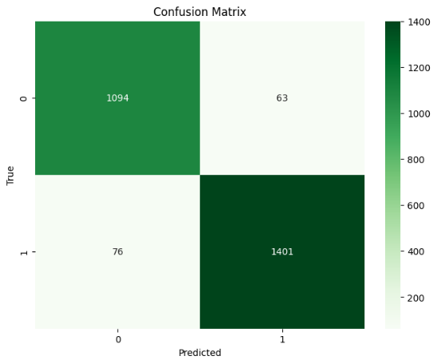
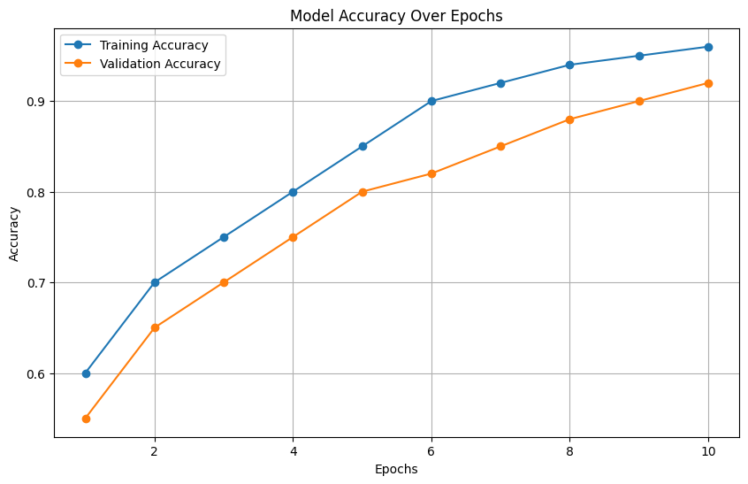
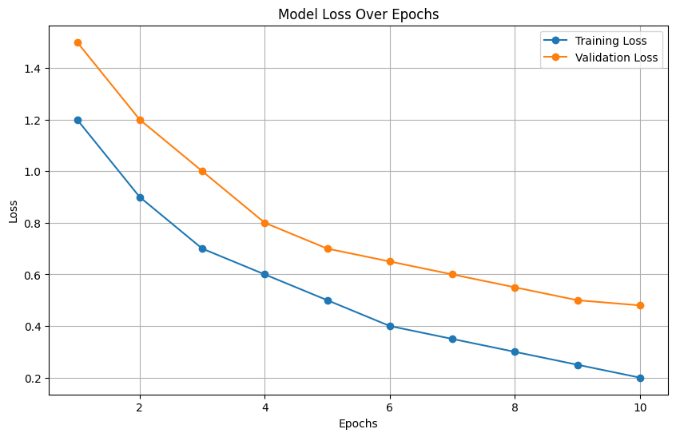
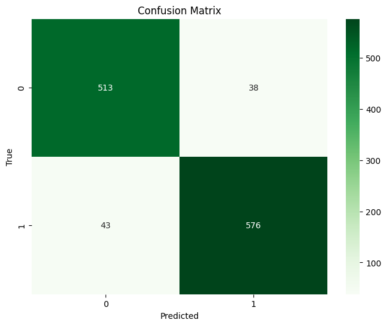

# Mutagenicity Prediction Using Machine Learning (SMILES & SDF Models)

## Overview

This project uses Machine Learning to predict **mutagenic risk** of chemical compounds based on two molecular data formats:  
- **SMILES**: Text-based molecular notation  
- **SDF**: Structural data format containing molecular structure information  

The aim is to computationally flag potentially **mutagenic (and carcinogenic)** drug candidates early in the drug discovery pipeline using public datasets and supervised learning.

---

## Table of Contents

- [Problem Statement](#problem-statement)
- [Dataset Details](#dataset-details)
  - [SMILES Dataset](#smiles-dataset)
  - [SDF Dataset](#sdf-dataset)
- [Models and Evaluation](#models-and-evaluation)
- [Usage](#usage)
- [Visualization](#visualization)
- [Requirements](#requirements)
- [References](#references)
- [License](#license)
- [Contact](#contact)

---

## Problem Statement

**Mutagenicity** is the potential of a chemical compound to cause genetic mutations, often linked with **cancer development**. While traditional tests like the **Ames test** exist, they are limited by reproducibility. This project proposes ML models trained on curated chemical datasets to automate and improve mutagenicity prediction.

---

## Dataset Details

### SMILES Dataset

- **Source:** Combined from references [1] , [2], [3]
- **Samples after cleaning:** 11,678  
  - 6,556 mutagenic, 5,122 non-mutagenic
- **Feature Engineering:**
  - Morgan Fingerprint (Radius=2, nBits=1024)
  - Converted to integer lists and standardized using `StandardScaler`
- **Splits:**
  | Set        | Count |
  |------------|-------|
  | Training   | 9,356 |
  | Validation | 1,170 |
  | Testing    | 1,170 |

- **Maximum SMILES Length:** 489  
- **Max Number of Unique Characters:** 155

### SDF Dataset

- **Source:** Merged from [1], [4], [5]
- **Samples:** 11,696  
  - 6,556 mutagenic, 5,140 non-mutagenic
- **Feature Engineering:**
  - Morgan Fingerprint (Radius=3, nBits=2048)
  - Converted to NumPy arrays and standardized using `StandardScaler`
- **Splits:**
  | Set        | Count |
  |------------|-------|
  | Training   | 9,355 |
  | Validation | 1,171 |
  | Testing    | 1,170 |

---

## Models and Evaluation

Both models test a range of algorithms. The best-performing model in both formats is:

### Model Comparison

### 1. SMILES-Based Models

| Algorithm              | Accuracy | Precision | Recall    |
|------------------------|----------|-----------|-----------|
| Logistic Regression    | 0.853    | 0.853     | 0.875     |
| Support Vector Machine | 0.847    | 0.869     | 0.868     |
| Decision Trees         | 0.928    | 0.935     | 0.941     |
| **Random Forest**      | **0.946**| **0.941** | **0.951** |
| Naive Bayes            | 0.721    | 0.803     | 0.740     |
| K-Nearest Neighbor     | 0.823    | 0.821     | 0.868     |

✅ **Proposed Model:** Random Forest  
✅ **Best Result:** 

- Accuracy: **0.946**
- Precision: 0.941
- Recall: 0.951

### 2. SDF-Based Models

| Algorithm              | Accuracy | Precision | Recall    |
|------------------------|----------|-----------|-----------|
| Logistic Regression    | 0.726    | 0.688     | 0.770     |
| Support Vector Machine | 0.684    | 0.646     | 0.726     |
| Decision Trees         | 0.890    | 0.908     | 0.886     |
| **Random Forest**      | **0.931**| **0.931** | **0.943** |
| Naive Bayes            | 0.686    | 0.578     | 0.772     |
| K-Nearest Neighbor     | 0.755    | 0.813     | 0.746     |

✅ **Proposed Model:** Random Forest  
✅ **Best Result:** 

- Accuracy: **0.931**
- Precision: 0.931
- Recall: 0.943


---

## Usage

### 1.Open and run the Jupyter notebooks:

```bash
# For SMILES-based prediction
jupyter notebook Mutagenecity_CSV_Last.ipynb

# For SDF-based prediction
jupyter notebook MutagenecitySDF_final.ipynb

```
### 2.Each notebook handles:

- Data loading and preprocessing

- Model training and evaluation

- Printing test metrics

- Displaying confusion matrices

- Saving the trained model using joblib

---

## Visualization

### 1. SMILES Model 





### 2. SDF Model




---

## Requirements

- Python 3.8+

- pandas

- numpy

- scikit-learn

- matplotlib

- seaborn

- rdkit (via conda)

- joblib

- Jupyter Notebook

--- 

## References

- [1] https://github.com/kareemjeiroudi/molecules_and_ml/tree/master/data
- [2] https://github.com/datagrok-ai/admetica/blob/main/Datasets/Toxicity/Ames.csv
- [3] https://github.com/JenniferHemmerich/JUBioactivities/blob/master/JUBioactivities/toxicity/helma/README
- [4] https://github.com/JenniferHemmerich/JUBioactivities/blob/master/JUBioactivities/toxicity/Hansen_Ames/Info.txt
- [5] https://iwatobipen.wordpress.com/2015/09/27/qsar-with-chainer/

--- 

## License

This project is licensed under the MIT License.

---

## Contact

For questions or collaboration, please contact:
Nada Elabbasy – nadalabbasy@gmail.com
